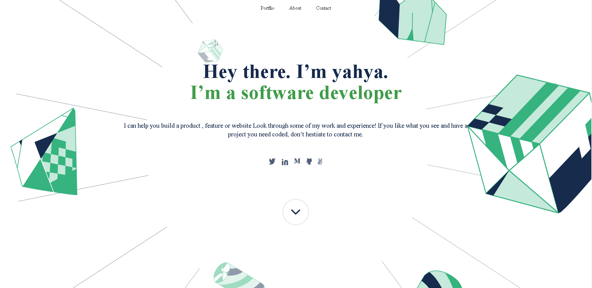
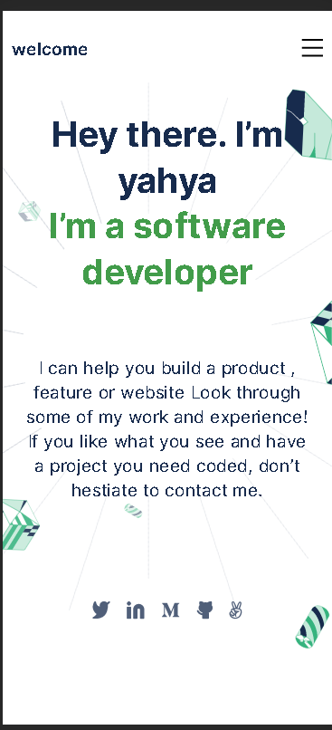

# mobaile version skeketion

**this is a profile page made with HTML and CSS it has all my links and contact**

## project sample

### desktop

### mobile

## livedemo version 

- [portflio](https://yahyaelganyni1.github.io/mobile-version-skeleton/)

## Getting Started

- this is a my  portfolio to showcase my programming skills

## author

- yahya elganayni

## my contact

- [twiter](https://twitter.com/crazy20046)
- [GirHub](https://twitter.com/crazy20046)
- [LinkedIn](https://www.linkedin.com/in/yahya-el-ganayni-a456115b/)
